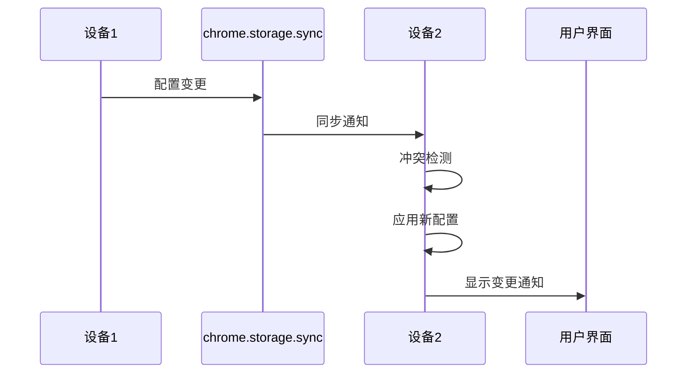
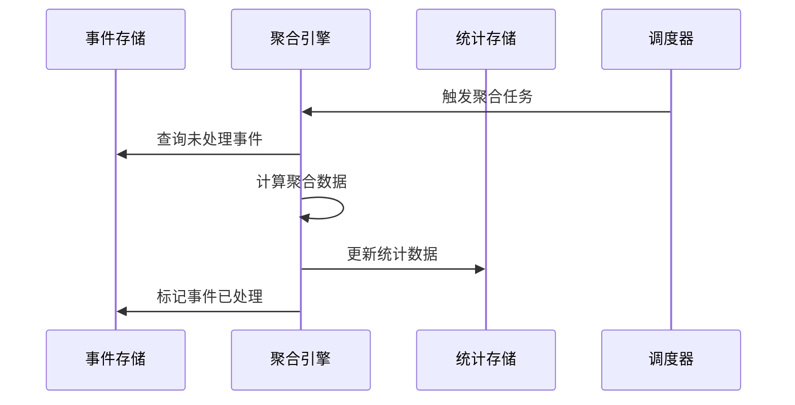

# 第三阶段：数据管理与同步

## 阶段概述

**目标**: 实现用户配置同步、数据生命周期管理和备份恢复功能

**预计工期**: 6-8个工作日  
**优先级**: 高（核心数据管理功能）  
**前置依赖**: 第一、二阶段完成

## 任务清单

### 3.1 配置同步引擎 ⭐⭐⭐
**预计工时**: 1.5天  
**负责模块**: `src/core/sync/config-sync-engine.ts`

#### 具体任务
- [ ] 实现chrome.storage.onChanged监听器
- [ ] 创建配置冲突检测机制
- [ ] 实现整体覆盖策略
- [ ] 添加变更通知系统
- [ ] 实现设备信息管理

#### 技术要求
```typescript
class ConfigSyncEngine {
  private deviceId: string;
  
  async syncConfiguration(config: UserConfiguration): Promise<void>;
  async handleRemoteConfigChange(changes: any): Promise<void>;
  detectConflict(localConfig: UserConfiguration, remoteConfig: UserConfiguration): boolean;
  resolveConflict(localConfig: UserConfiguration, remoteConfig: UserConfiguration): UserConfiguration;
  notifyConfigChange(oldConfig: UserConfiguration, newConfig: UserConfiguration): void;
}
```

#### 验收标准
- [ ] 配置同步实时生效
- [ ] 冲突检测准确可靠
- [ ] 覆盖策略符合PRD要求
- [ ] 用户通知清晰明确

---

### 3.2 数据生命周期管理 ⭐⭐⭐
**预计工时**: 2天  
**负责模块**: `src/core/lifecycle/data-lifecycle-manager.ts`

#### 具体任务
- [ ] 实现保留策略配置管理
- [ ] 创建数据清理引擎
- [ ] 实现策略变更处理
- [ ] 添加清理任务调度
- [ ] 创建清理进度监控

#### 技术要求
```typescript
interface RetentionPolicy {
  type: 'immediate' | 'short' | 'long' | 'permanent';
  days?: number;
  autoCleanup: boolean;
}

class DataLifecycleManager {
  async applyNewPolicy(policy: RetentionPolicy): Promise<void>;
  async executeCleanupTask(policy: RetentionPolicy): Promise<CleanupResult>;
  async schedulePeriodicCleanup(): void;
  async getDataUsageStats(): Promise<StorageStats>;
}
```

#### 验收标准
- [ ] 保留策略正确执行
- [ ] 数据清理安全可靠
- [ ] 策略变更用户确认
- [ ] 清理进度实时反馈

---

### 3.3 数据聚合引擎 ⭐⭐⭐
**预计工时**: 2天  
**负责模块**: `src/core/analytics/aggregation-engine.ts`

#### 具体任务
- [ ] 实现事件到统计数据的聚合算法
- [ ] 创建增量聚合机制
- [ ] 实现checkpoint事件处理
- [ ] 添加聚合任务调度
- [ ] 创建聚合状态管理

#### 技术要求
```typescript
interface AggregationResult {
  date: string;
  url: string;
  hostname: string;
  parentDomain: string;
  totalOpenTime: number;
  totalActiveTime: number;
  lastUpdated: number;
}

class AggregationEngine {
  async processEvents(events: DomainEvent[]): Promise<AggregationResult[]>;
  async handleCheckpointEvent(event: DomainEvent): Promise<void>;
  async runIncrementalAggregation(): Promise<void>;
  async runFullAggregation(): Promise<void>;
}
```

#### 验收标准
- [ ] 聚合计算准确无误
- [ ] 增量更新性能良好
- [ ] Checkpoint处理及时
- [ ] 聚合任务稳定运行

---

### 3.4 数据导出导入 ⭐⭐
**预计工时**: 1.5天  
**负责模块**: `src/core/storage/data-export-import.ts`

#### 具体任务
- [ ] 实现统计数据导出功能
- [ ] 实现原始日志导出功能
- [ ] 创建数据导入解析器
- [ ] 实现智能合并算法
- [ ] 添加数据验证机制

#### 技术要求
```typescript
interface ExportOptions {
  dataType: 'stats' | 'logs' | 'both';
  dateRange?: { start: string; end: string };
  format: 'json';
}

class DataExportImport {
  async exportData(options: ExportOptions): Promise<Blob>;
  async importData(file: File): Promise<ImportResult>;
  async mergeImportedData(importedData: any, existingData: any): Promise<MergeResult>;
  validateImportData(data: any): ValidationResult;
}
```

#### 验收标准
- [ ] 导出数据格式正确
- [ ] 导入解析无错误
- [ ] 智能合并逻辑正确
- [ ] 数据验证完整

---

### 3.5 崩溃恢复机制 ⭐⭐⭐
**预计工时**: 1.5天  
**负责模块**: `src/core/recovery/crash-recovery.ts`

#### 具体任务
- [ ] 实现孤儿会话检测算法
- [ ] 创建恢复事件生成器
- [ ] 实现启动时恢复流程
- [ ] 添加恢复状态跟踪
- [ ] 创建恢复日志记录

#### 技术要求
```typescript
interface OrphanSession {
  visitId: string;
  activityId?: string;
  lastEventTime: number;
  tabId: number;
  url: string;
}

class CrashRecovery {
  async detectOrphanSessions(): Promise<OrphanSession[]>;
  async generateRecoveryEvents(orphans: OrphanSession[]): Promise<DomainEvent[]>;
  async executeRecoveryFlow(): Promise<RecoveryResult>;
  async cleanupRecoveryState(): Promise<void>;
}
```

#### 验收标准
- [ ] 孤儿会话检测准确
- [ ] 恢复事件生成正确
- [ ] 恢复流程执行顺利
- [ ] 恢复时间符合NFR要求

## 阶段交付物

### 核心文件结构
```
src/
├── core/
│   ├── sync/
│   │   ├── index.ts
│   │   ├── config-sync-engine.ts
│   │   └── sync-state-manager.ts
│   ├── lifecycle/
│   │   ├── index.ts
│   │   ├── data-lifecycle-manager.ts
│   │   └── cleanup-engine.ts
│   ├── analytics/
│   │   ├── index.ts
│   │   ├── aggregation-engine.ts
│   │   └── aggregation-scheduler.ts
│   ├── storage/
│   │   ├── index.ts
│   │   ├── data-export-import.ts
│   │   └── backup-manager.ts
│   └── recovery/
│       ├── index.ts
│       ├── crash-recovery.ts
│       └── recovery-state.ts
└── models/
    ├── sync/
    │   └── sync-models.ts
    └── analytics/
        └── aggregation-models.ts
```

### 集成测试场景
- [ ] 多设备配置同步测试
- [ ] 数据清理策略验证
- [ ] 聚合数据准确性测试
- [ ] 导出导入完整性测试
- [ ] 崩溃恢复功能测试

### 性能指标
- [ ] 配置同步延迟 < 5秒
- [ ] 数据聚合CPU占用 < 10%
- [ ] 清理任务CPU占用 < 5%
- [ ] 恢复流程时间 < 5秒

## 关键算法设计

### 配置冲突解决算法
```typescript
class ConflictResolver {
  resolveConflict(local: UserConfiguration, remote: UserConfiguration): UserConfiguration {
    // 基于lastModified时间戳的整体覆盖策略
    if (remote.lastModified > local.lastModified) {
      return { ...remote, deviceId: this.deviceId };
    }
    return local;
  }
}
```

### 数据聚合算法
```typescript
class TimeAggregator {
  aggregateTimeData(events: DomainEvent[]): AggregationResult {
    // 按URL分组事件
    // 计算Open Time和Active Time
    // 处理checkpoint事件的增量计算
    // 更新last_updated时间戳
  }
}
```

### 智能合并算法
```typescript
class DataMerger {
  mergeStatistics(imported: AggregationResult[], existing: AggregationResult[]): AggregationResult[] {
    // 基于last_updated时间戳的智能合并
    // 保留最新的数据记录
    // 处理数据冲突和重复
  }
}
```

## 数据流设计

### 配置同步流程


### 数据聚合流程


## 风险与应对

### 主要风险
1. **配置同步冲突频繁**
   - 应对：优化冲突检测算法，减少误判
   - 监控：同步冲突频率统计

2. **数据聚合性能问题**
   - 应对：实现增量聚合，避免全量计算
   - 优化：批量处理和索引优化

3. **数据导入导出错误**
   - 应对：严格的数据验证和错误处理
   - 测试：多种数据格式兼容性测试

### 质量保证
- 数据一致性测试：确保聚合数据准确
- 同步可靠性测试：多设备同步场景验证
- 恢复机制测试：模拟各种崩溃场景
- 性能压力测试：大数据量处理能力

## 下一阶段准备

完成本阶段后，需要为第四阶段准备：
- [ ] 查询API接口设计
- [ ] UI组件设计规范
- [ ] 数据可视化方案
- [ ] 用户交互流程设计

---

**阶段负责人**: [待分配]  
**开始日期**: [待确定]  
**预期完成**: [待确定]
