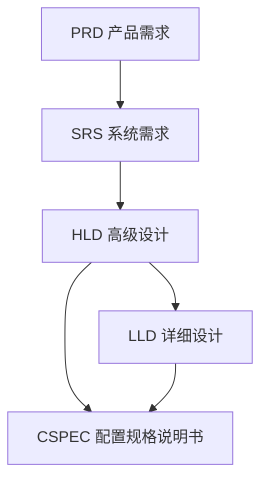

# 项目文档总览 (v1.2 修订版)

## 文档架构概述

本项目采用**分层文档架构**，遵循单一职责原则，确保每个文档职责清晰、边界明确。所有文档按照**需求→设计→实现**的递进关系组织，形成从“做什么”到“如何做”再到“如何实现”的清晰路径。

## 项目文档清单

### **第一层：业务需求层**

**1. 产品需求文档 (PRD)**

- **文件名：** `01-产品需求文档(PRD).md`
- **职责：** 定义产品要实现的功能和业务价值，回答 **“做什么”**。
- **目标受众：** 产品经理、业务分析师、项目干系人
- **内容：** 用户故事、功能规格、业务规则、验收标准。

### **第二层：系统需求与设计层**

**2. 系统需求规格说明书 (SRS)**

- **文件名：** `02-系统需求规格说明书(SRS).md`
- **职责：** 将产品需求转化为系统级的技术语言，定义系统 **“必须满足什么条件”**，侧重于系统的外部行为和约束。
- **目标受众：** 系统架构师、技术负责人、测试工程师
- **内容：** 功能性需求列表、非功能性需求（性能、安全、可靠性）、外部接口约束。

**3. 高级设计文档 (HLD - High-Level Design)**

- **文件名：** `03-高级设计文档(HLD).md`
- **职责：** 基于系统需求，提供系统级的架构方案，回答 **“系统如何运作”**。
- **目标受众：** 系统架构师、技术负责人、资深工程师
- **内容：** 系统架构图、技术栈选型、核心模块划分与职责、关键数据模型、核心组件间接口定义。

### **第三层：技术实现层**

**4. 详细设计文档 (LLD - Low-Level Design)**

- **文件名：** `04-详细设计文档(LLD).md`
- **职责：** 对高级设计中的各个模块进行细化，提供可直接指导编码的实现方案，回答 **“代码如何编写”**。
- **目标受众：** 开发工程师、技术团队
- **内容：** 模块/组件内部设计、类图与序列图、详细API接口规格、数据库表结构设计、关键算法逻辑。

### **第四层：运维与配置层（支撑文档）**

**5. 配置规格说明书 (CSPEC - Configuration Specification)**

- **文件名：** `05-配置规格说明书(CSPEC).md`
- **职责：** 管理所有可调参数和配置项，作为设计和运维的参考依据。
- **目标受众：** 开发工程师、运维人员、技术支持
- **内容：** 配置参数定义、默认值、取值范围、调整策略、环境差异。

## 文档依赖关系

- **解读：** PRD指导SRS，SRS指导HLD，HLD指导LLD。高级设计（HLD）和详细设计（LLD）共同为《配置规格说明书》（CSPEC）提供输入，定义需要配置化的项目。

## 文档版本控制原则

- **独立版本管理：** 每个文档使用独立的版本号（例如，遵循语义化版本）。
- **依赖关系追踪：** 在文档头部明确其所依赖的上层文档的版本号。
- **变更影响分析：** 上层文档变更后，必须创建任务来评估并更新所有受影响的下层文档。

## 审核和维护流程

1. **PRD** → 产品团队审核 → 业务干系人确认
2. **SRS** → 架构师与测试负责人审核 → 技术负责人确认
3. **HLD** → 架构团队与资深工程师审核 → 技术负责人确认
4. **LLD** → 开发团队内部评审 → 技术负责人或模块负责人确认
5. **CSPEC** → 开发与运维团队联合审核

---