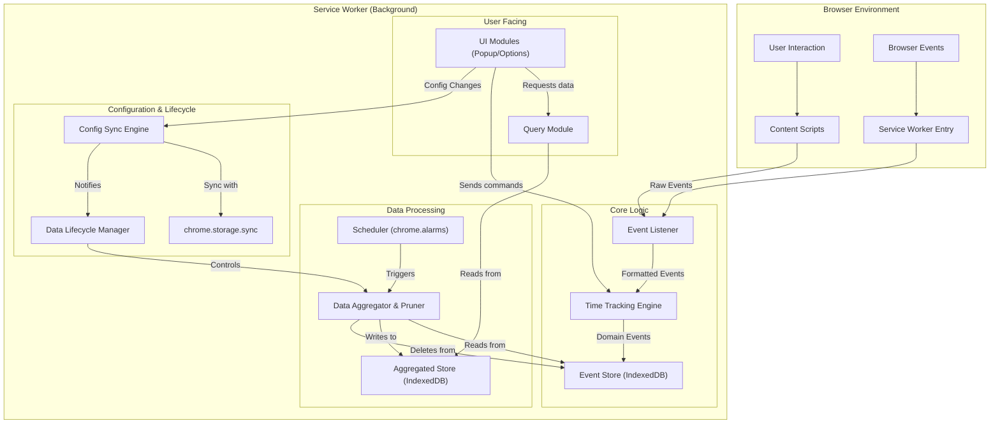
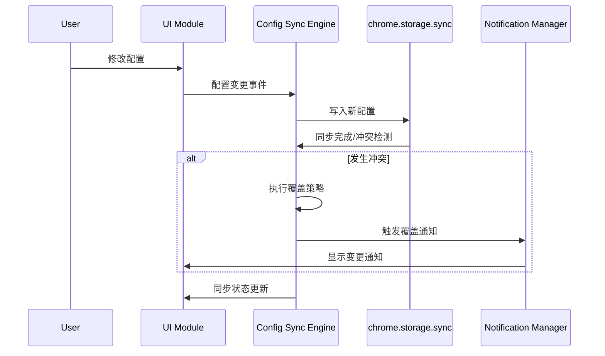
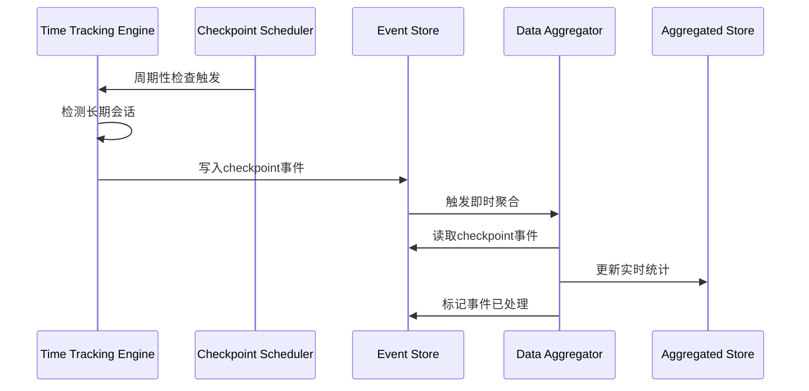
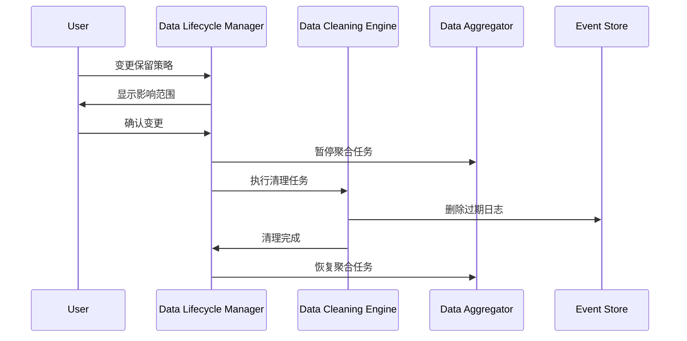
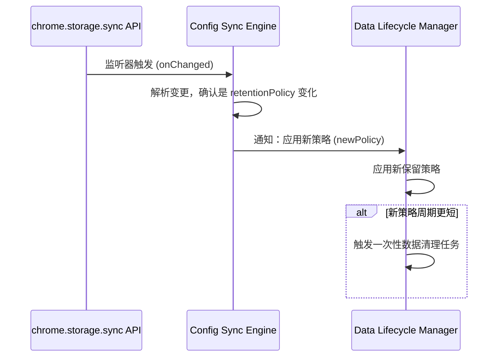

# 03-高级设计文档(HLD).md

## 1. 文档信息

| 属性 | 内容 |
| --- | --- |
| **文档名称** | Chrome 网页时间追踪扩展 - 高级设计文档 |
| **文档版本** | v2.0.1 (范围修正版) |
| **创建日期** | 2025年6月17日 |
| **目标受众** | 系统架构师、技术负责人、资深工程师 |
| **依赖文档** | `01-产品需求文档(PRD).md` (v2.1.2)<br>`02-系统需求规格说明书(SRS).md` (v2.1.0) |

## 2. 文档范围与边界 (Scope and Boundaries)

本高级设计文档（HLD）旨在将系统需求转化为可执行的架构蓝图，其职责是回答系统“如何运作”。

**本文档包含 (In Scope):**

- 系统整体架构设计与模块划分
- 核心技术栈的选型与理由
- 关键数据流与核心数据模型定义
- 核心模块间的接口与交互契约

**本文档不包含 (Out of Scope):**

- 模块内部的具体算法和类的实现细节
- 详细的数据库表结构或API接口规格
- 任何与用户界面（UI）相关的详细设计

## 3. 系统架构设计

### 3.1 架构概述

为满足SRS中对可靠性、跨设备同步和数据生命周期管理的要求，本系统采用**基于事件驱动的、分层数据管理架构**。该架构以三类数据的分类管理为核心，通过分层存储策略和模块化设计，实现了用户配置的跨设备同步、原始数据的生命周期管理和聚合数据的可靠备份。所有后台逻辑均在单一的Service Worker环境中运行，确保了Manifest V3架构下的高效与合规。

### 3.2 架构图



- **解读**: 架构图准确反映了所有后台逻辑（计时、聚合、配置同步、生命周期管理）均在同一个`Service Worker (Background)`环境中运行。用户交互和浏览器事件作为输入，经过模块化处理后，最终影响`IndexedDB`中的数据存储，并由`Query Module`向UI提供数据。

### 3.3 技术栈选型

| 数据类型 | 存储技术 | 选型理由 |
| --- | --- | --- |
| **用户配置数据** | `chrome.storage.sync` | 支持跨设备自动同步，符合用户期望的一致性体验。数据量小（<100KB），适合sync存储的容量限制。 |
| **实时会话状态** | `chrome.storage.local` | 高性能读写，支持Service Worker重启后的快速状态恢复。用于存储易变的活动映射表。 |
| **原始事件日志** | `IndexedDB (events_log表)` | 支持大容量事务性写入，提供索引查询能力，满足事件日志的快速写入和批量处理需求。 |
| **聚合统计数据** | `IndexedDB (aggregated_stats表)` | 支持复杂查询和数据分析，提供持久化保证，满足统计数据的长期存储和快速检索需求。 |
| **核心逻辑** | TypeScript | 提供强类型支持，提高代码质量和可维护性，符合现代Web开发标准。 |
| **公共后缀列表** | `psl` (npm package) | 引入可靠的第三方库处理域名解析，实现精准的主域名提取功能。 |

## 4. 核心模块职责

### 4.1 时间追踪引擎模块 (Time Tracking Engine)

- **职责**: 实现PRD中定义的核心业务规则，包括“单一焦点”原则、“情景感知”计时逻辑，并根据调度创建`Checkpoint`事件。

### 4.2 数据持久化模块 (Data Persistence)

- **职责**: 管理三类数据的分层存储和生命周期，确保数据可靠性和查询性能。

### 4.3 用户配置同步模块 (Configuration Sync Engine)

- **职责**: 管理用户配置的跨设备同步、冲突处理和变更通知。当监听到来自`chrome.storage.onChanged`的外部配置变更时，负责解析变更并**通知**其他相关模块（如数据生命周期管理模块）应用新配置。

### 4.4 数据生命周期管理模块 (Data Lifecycle Manager)

- **职责**: 根据用户策略管理原始事件日志的保留和清理。**接收**来自配置同步模块的通知，以应用新的数据保留策略。

### 4.5 内容脚本模块 (Content Scripts)

- **职责**: 作为Service Worker感知能力的延伸，捕获页面级用户交互。

### 4.6 数据查询模块 (Query Module)

- **职责**: 提供统一的数据查询接口，支持分层聚合和多维度分析。

## 5. 关键数据流设计

### 5.1 用户配置同步数据流



### 5.2 Checkpoint增强数据流



### 5.3 数据清理协调流程



### 5.4 同步配置应用流程 (新增)



- **解读**: 此流程解决了模块间的交互缺失问题。系统通过监听`chrome.storage.onChanged`事件，使得`配置同步模块`能够感知到外部设备同步过来的配置变更，并随后通知`数据生命周期管理模块`应用新策略，从而形成了一个完整的功能闭环。

## 6. 核心数据模型

### 6.1 配置数据模型

**存储位置**: `chrome.storage.sync`**结构设计**:

```tsx
interface UserConfiguration {
  version: string;
  lastModified: number;
  deviceId: string;
  retentionPolicy: 'immediate' | 'short' | 'long' | 'permanent';
  uiTheme: 'light' | 'dark' | 'auto';
  filterRules: string[];
}

```

### 6.2 事件日志模型

**存储位置**: `IndexedDB - events_log表`**关键字段**:

- 新增`eventType`支持: `'checkpoint'`类型
- 增强索引策略: `visitId`, `activityId`, `isProcessed`, `timestamp`

### 6.3 聚合数据模型

**存储位置**: `IndexedDB - aggregated_stats表`**关键字段**: `date` (YYYY-MM-DD), `hostname`, `url_path`, `total_open_time`, `total_active_time`, `last_updated`。

- **备注**: `last_updated`字段是实现`FR-4C`中定义的、基于备份恢复的智能合并逻辑的唯一依据。聚合统计数据不涉及跨设备同步。

## 7. 模块间接口定义

### 7.1 配置同步接口

```tsx
interface ConfigSyncInterface {
  // ... 其他方法
  listenForChanges(): void; // 监听 chrome.storage.onChanged
  dispatchConfigUpdate(newConfig: UserConfiguration): void; // 内部事件分发
}

```

### 7.2 数据清理接口

```tsx
interface DataCleanupInterface {
  applyNewPolicy(policy: RetentionPolicy): Promise<void>; // 接收新策略并应用
  // ... 其他方法
}

```
