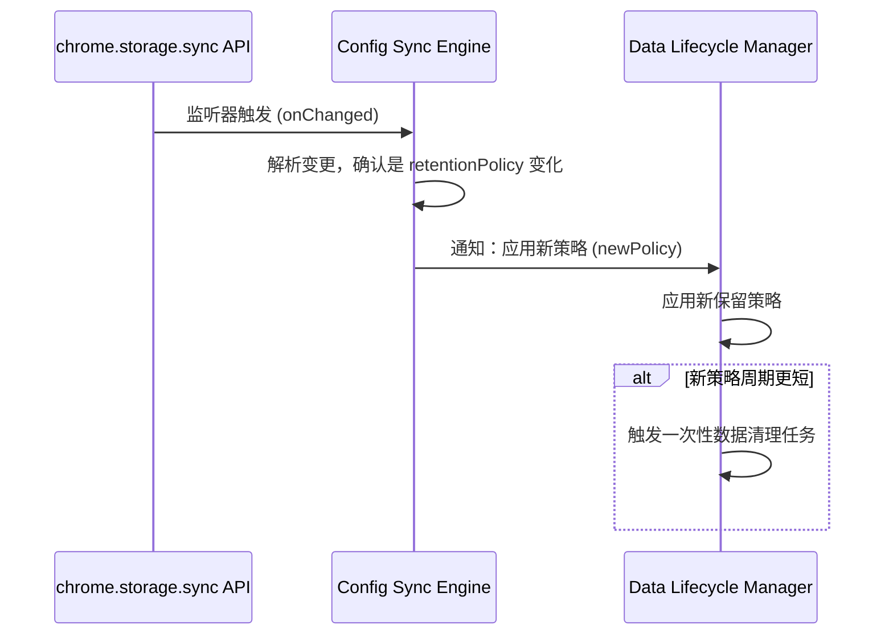

# 04-详细设计文档(LLD).md

## 1. 文档信息

| 属性         | 内容                                   |
| ------------ | -------------------------------------- |
| **文档名称** | Chrome 网页时间追踪扩展 - 详细设计文档 |
| **文档版本** | v1.0.1 (范围修正版)                    |
| **创建日期** | 2025年6月18日                          |
| **目标受众** | 开发工程师、技术团队                   |
| **依赖文档** | `03-高级设计文档(HLD).md` (v2.0.1)     |

## 2. 文档范围与边界 (Scope and Boundaries)

本详细设计文档（LLD）旨在将高级设计中的各个模块进行细化，提供可直接指导编码的实现方案。本文档包含核心模块的内部设计、详细的模块间接口（API）规格、`IndexedDB`数据库的详细表结构设计以及关键业务流程的详细算法逻辑。本文档不包含具体的项目构建配置、依赖管理、UI组件库的具体实现或完整的可运行代码。

## 3. 数据库详细设计

### 3.1 数据库技术

- **数据库**: `IndexedDB`
- **版本**: 1
- **对象存储 (Object Stores)**: `events_log`, `aggregated_stats`

### 3.2 `events_log` 表结构

**用途**: 存储所有原始领域事件，作为系统的事实数据源（Source of Truth），支持抗中断写入和异步聚合。

| 字段名        | 数据类型         | 描述                                                                                                               |
| ------------- | ---------------- | ------------------------------------------------------------------------------------------------------------------ |
| `id`          | `number`         | **主键**，自增。                                                                                                   |
| `timestamp`   | `number`         | 事件发生的时间戳 (`Date.now()`)。                                                                                  |
| `eventType`   | `string`         | 事件类型枚举: `'open_time_start'`, `'open_time_end'`, `'active_time_start'`, `'active_time_end'`, `'checkpoint'`。 |
| `tabId`       | `number`         | 关联的浏览器标签页ID。                                                                                             |
| `url`         | `string`         | 完整的URL（路径和关键参数）。                                                                                      |
| `visitId`     | `string`         | 唯一访问标识符 (UUID)，与`Open Time`生命周期绑定。                                                                 |
| `activityId`  | `string \| null` | 唯一活跃区间标识符 (UUID)，与`Active Time`生命周期绑定，可为null。                                                 |
| `isProcessed` | `number`         | **索引字段**。是否已被聚合器处理 (`0` for false, `1` for true)。                                                   |
| `resolution`  | `string \| null` | **可选**。标记特殊的事件来源，如`'crash_recovery'`。                                                               |

**索引 (Indexes):**

- **`isProcessed_idx`**: on `isProcessed` (用于快速查询未处理事件)。
- **`visitId_idx`**: on `visitId` (用于按访问会话分组)。
- **`activityId_idx`**: on `activityId` (用于按活跃区间分组)。

### 3.3 `aggregated_stats` 表结构

**用途**: 存储最终计算出的、用于查询展示的历史数据。

| 字段名              | 数据类型 | 描述                                                                           |
| ------------------- | -------- | ------------------------------------------------------------------------------ |
| `key`               | `string` | **主键**。格式为 `YYYY-MM-DD:full_url` 的组合键，确保每日每个URL的唯一性。     |
| `date`              | `string` | **索引字段**。日期，格式为`YYYY-MM-DD`。                                       |
| `url`               | `string` | 完整的URL，作为聚合的最小粒度。                                                |
| `hostname`          | `string` | **索引字段**。URL的主机名，用于中层聚合。                                      |
| `parentDomain`      | `string` | **索引字段**。URL的父域名（基于PSL计算），用于顶层聚合。                       |
| `total_open_time`   | `number` | 累积的打开时间，单位：秒。                                                     |
| `total_active_time` | `number` | 累积的活跃时间，单位：秒。                                                     |
| `last_updated`      | `number` | 该记录最后一次被更新的时间戳 (`Date.now()`)，是实现`FR-4C`智能合并的唯一依据。 |

**索引 (Indexes):**

- **`date_idx`**: on `date` (用于按日期范围查询)。
- **`hostname_idx`**: on `hostname`。
- **`parentDomain_idx`**: on `parentDomain`。

## 4. 核心模块详细设计

### 4.1 计时引擎模块 (Time Tracking Engine)

**单一焦点原则实现**:
为了严格遵守`PRD v2.1.2`中定义的“单一焦点原则”，计时引擎的所有事件处理方法必须在其逻辑入口处增加一个强制性的前置条件检查。该检查将验证事件所关联的`tabId`是否与当前浏览器窗口中唯一激活的焦点标签页ID一致，所有来自非焦点标签页的事件都将被忽略。

**伪代码示例**:

```tsx
class TimeTracker {
  private async isFocusTab(tabId: number): Promise<boolean> {
    const [activeTab] = await chrome.tabs.query({ active: true, lastFocusedWindow: true });
    return activeTab?.id === tabId;
  }

  async handleInteraction(tabId: number): Promise<DomainEvent[]> {
    // 强制单一焦点前置检查
    if (!(await this.isFocusTab(tabId))) {
      return []; // 忽略非焦点标签页的事件
    }
    // ... (处理焦点标签页交互的逻辑)
    return [];
  }
}
```

### 4.2 用户配置同步模块 (Configuration Sync Engine)

此模块负责管理用户配置的跨设备同步，并实现`PRD FR-4A`定义的“整体覆盖+用户透明”冲突处理策略。模块初始化时，必须注册 `chrome.storage.onChanged` 监听器以感知外部配置变更，并通过内部事件总线分发`configUpdated`事件，通知其他模块响应此变更。

### 4.3 数据生命周期管理模块 (Data Lifecycle Manager)

该模块负责根据用户策略管理原始事件日志的保留和清理。模块初始化时，必须订阅`configUpdated`事件，以便在接收到策略变更通知后应用新的保留策略。当需要执行清理任务时，必须与数据聚合任务进行协调，以满足`SYS-FR-2.6`的要求。

### 4.4 启动恢复与初始化流程 (新增)

为满足`SRS SYS-FR-2.4`定义的“孤儿会话”处理要求，扩展启动时必须执行一个两阶段的恢复与初始化流程。

**第一阶段：恢复阶段 (Recovery Phase)**

1. 记录启动时间戳 `startup_time`。
2. 扫描`events_log`表，识别所有只有起点事件（`..._start`）而没有对应终点事件的“孤儿会话”。
3. 对于每一个识别出的孤儿会话，找到其最新的一个事件时间戳 `T_last_known_event`。
4. 以`T_last_known_event`作为时间戳，为该孤儿会话人工合成对应的终点事件，并设置 `resolution: 'crash_recovery'`字段。
5. 将合成的终点事件写入`events_log`表，并立即触发一次恢复性聚合任务。

**第二阶段：交互驱动初始化阶段 (Interaction-Driven Initialization Phase)**

1. 清空`chrome.storage.local`中的旧的实时会话状态。
2. 使用 `chrome.tabs.query({})` 获取所有当前已打开的标签页列表。
3. 遍历所有这些标签页，为每个标签页生成新的`visitId`，以`startup_time`作为它们`Open Time`的初始起点，并写入`open_time_start`事件。
4. **关键原则**：系统在启动时不为任何标签页预设活跃状态或生成`activityId`，`Active Time`计时将在用户首次与任何焦点标签页产生真实交互时才开始。

### 4.5 存储配额管理 (新增)

为满足`SRS NFR-2.2`定义的存储配额超限处理要求，系统在捕获到`QuotaExceededError`时必须执行以下分级响应策略。

1. **第一级（自动清理）**：系统自动触发数据清理任务，尝试根据用户设定的保留策略，清理最旧的、且已被聚合的原始事件日志，然后重试写入。
2. **第二级（暂停并通知）**：如果写入在清理后仍然失败，系统必须立即暂停所有新的日志记录。同时，通过UI向用户显示一个持久化的通知，明确告知存储空间已满。
3. **第三级（用户引导）**：该通知必须清晰地引导用户前往设置页面进行手动数据管理（如导出数据、调整保留策略等）。

## 5. 关键流程序列图

### 5.1 同步配置应用流程

此图详细描述了当一个配置从外部设备同步过来后，系统内部模块如何交互以应用新配置的完整流程。



## 6. 模块间接口定义 (TypeScript Interfaces)

这些接口定义了模块之间通信的契约，是实现低耦合设计的关键。

```tsx
// 用户配置对象结构
interface UserConfiguration {
  version: string;
  lastModified: number;
  deviceId: string; // 标识最后修改的设备
  retentionPolicy: 'immediate' | 'short' | 'long' | 'permanent';
  uiTheme: 'light' | 'dark' | 'auto';
  // ... 其他配置项
}

// 领域事件统一结构
interface DomainEvent {
  id?: number;
  timestamp: number;
  eventType:
    | 'open_time_start'
    | 'open_time_end'
    | 'active_time_start'
    | 'active_time_end'
    | 'checkpoint';
  tabId: number;
  url: string;
  visitId: string;
  activityId: string | null;
  isProcessed: 0 | 1;
  resolution?: 'crash_recovery';
}

// 数据清理服务接口
interface IDataCleanupService {
  /**
   * 应用新的保留策略，并在必要时触发清理
   * @param policy 新的保留策略
   */
  applyNewPolicy(policy: string): Promise<void>;

  /**
   * 执行一次性的数据清理任务
   * @param policy 要执行的清理策略
   */
  runCleanupTask(policy: string): Promise<{ deletedCount: number }>;
}
```
