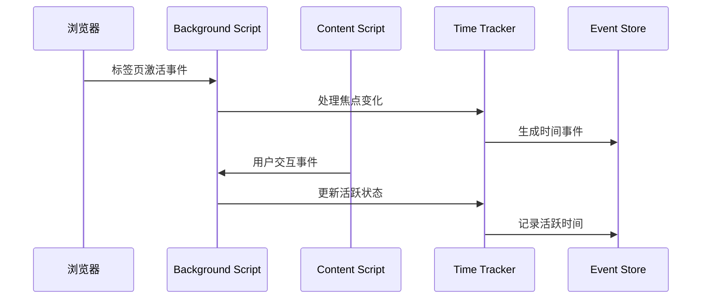

# 第二阶段：时间追踪引擎

## 阶段概述

**目标**: 实现核心的时间追踪逻辑，包括单一焦点原则、情景感知计时和事件处理机制

**预计工期**: 8-10个工作日  
**优先级**: 最高（核心业务逻辑）  
**前置依赖**: 第一阶段完成

## 任务清单

### 2.1 浏览器事件监听器 ⭐⭐⭐
**预计工时**: 2天  
**负责模块**: `src/entrypoints/background/`

#### 具体任务
- [ ] 实现chrome.tabs事件监听
- [ ] 实现chrome.webNavigation事件监听
- [ ] 实现chrome.windows焦点事件监听
- [ ] 创建事件路由和分发机制
- [ ] 添加事件去重和防抖处理

#### 技术要求
```typescript
class BrowserEventListener {
  // 标签页事件
  onTabActivated(tabId: number): void;
  onTabUpdated(tabId: number, changeInfo: any): void;
  onTabRemoved(tabId: number): void;
  
  // 导航事件
  onNavigationCompleted(details: any): void;
  onHistoryStateUpdated(details: any): void;
  
  // 窗口事件
  onWindowFocusChanged(windowId: number): void;
}
```

#### 验收标准
- [ ] 所有关键浏览器事件正确监听
- [ ] 事件处理无遗漏和重复
- [ ] SPA路由变化正确检测
- [ ] 事件处理性能满足要求

---

### 2.2 单一焦点原则实现 ⭐⭐⭐
**预计工时**: 1.5天  
**负责模块**: `src/core/tracker/focus-manager.ts`

#### 具体任务
- [ ] 实现焦点标签页检测逻辑
- [ ] 创建焦点状态管理器
- [ ] 实现非焦点事件过滤机制
- [ ] 添加焦点切换事件处理
- [ ] 实现多窗口焦点协调

#### 技术要求
```typescript
class FocusManager {
  private currentFocusTab: number | null = null;
  
  async isFocusTab(tabId: number): Promise<boolean>;
  async updateFocusTab(tabId: number): Promise<void>;
  onFocusChanged(oldTabId: number | null, newTabId: number): void;
}
```

#### 验收标准
- [ ] 严格遵循单一焦点原则
- [ ] 焦点切换检测准确及时
- [ ] 多窗口场景处理正确
- [ ] 焦点状态持久化可靠

---

### 2.3 情景感知计时 ⭐⭐⭐
**预计工时**: 2天  
**负责模块**: `src/core/tracker/context-detector.ts`

#### 具体任务
- [ ] 实现媒体播放状态检测
- [ ] 创建交互类型分类器
- [ ] 实现不同超时阈值管理
- [ ] 添加情景切换处理逻辑
- [ ] 创建情景状态持久化

#### 技术要求
```typescript
enum InteractionContext {
  ACTIVE_INTERACTION = 'active',
  PASSIVE_MEDIA = 'passive_media',
  INACTIVE = 'inactive'
}

class ContextDetector {
  detectContext(tabId: number): Promise<InteractionContext>;
  getTimeoutThreshold(context: InteractionContext): number;
  onContextChanged(tabId: number, oldContext: InteractionContext, newContext: InteractionContext): void;
}
```

#### 验收标准
- [ ] 准确区分主动交互和被动媒体消费
- [ ] 超时阈值配置正确应用
- [ ] 情景切换处理无缝
- [ ] 媒体状态检测可靠

---

### 2.4 用户交互检测 ⭐⭐
**预计工时**: 1.5天  
**负责模块**: `src/entrypoints/content.ts`

#### 具体任务
- [ ] 实现鼠标事件监听和过滤
- [ ] 实现键盘事件监听
- [ ] 实现滚动事件监听和阈值检查
- [ ] 创建交互事件去重机制
- [ ] 实现与background的消息通信

#### 技术要求
```typescript
class InteractionDetector {
  private mouseMoveThreshold = 10; // pixels
  private scrollThreshold = 20;    // pixels
  
  onMouseMove(event: MouseEvent): void;
  onKeyPress(event: KeyboardEvent): void;
  onScroll(event: Event): void;
  sendInteractionEvent(type: string): void;
}
```

#### 验收标准
- [ ] 交互检测灵敏度适中
- [ ] 事件过滤减少噪音
- [ ] 消息通信稳定可靠
- [ ] 性能影响最小化

---

### 2.5 会话状态管理 ⭐⭐⭐
**预计工时**: 2天  
**负责模块**: `src/core/tracker/session-manager.ts`

#### 具体任务
- [ ] 实现visitId生成和管理
- [ ] 实现activityId生成和管理
- [ ] 创建会话状态持久化
- [ ] 实现会话超时处理
- [ ] 添加会话状态恢复机制

#### 技术要求
```typescript
interface SessionState {
  visitId: string;
  activityId: string | null;
  startTime: number;
  lastActivity: number;
  url: string;
  tabId: number;
}

class SessionManager {
  createVisit(tabId: number, url: string): Promise<string>;
  startActivity(visitId: string): Promise<string>;
  endActivity(activityId: string): Promise<void>;
  cleanupExpiredSessions(): Promise<void>;
}
```

#### 验收标准
- [ ] 会话ID生成唯一可靠
- [ ] 会话状态正确维护
- [ ] 超时处理逻辑正确
- [ ] 状态恢复机制有效

---

### 2.6 Checkpoint机制 ⭐⭐⭐
**预计工时**: 1.5天  
**负责模块**: `src/core/tracker/checkpoint-manager.ts`

#### 具体任务
- [ ] 实现长期会话检测逻辑
- [ ] 创建checkpoint事件生成
- [ ] 实现定时检查调度器
- [ ] 添加即时聚合触发
- [ ] 创建checkpoint配置管理

#### 技术要求
```typescript
class CheckpointManager {
  private activeTimeThreshold = 2 * 60 * 60 * 1000; // 2小时
  private openTimeThreshold = 4 * 60 * 60 * 1000;   // 4小时
  
  checkLongSessions(): Promise<void>;
  createCheckpoint(sessionId: string, type: 'active' | 'open'): Promise<void>;
  schedulePeriodicCheck(): void;
  triggerImmediateAggregation(checkpointEvent: any): Promise<void>;
}
```

#### 验收标准
- [ ] 长期会话正确识别
- [ ] Checkpoint事件及时生成
- [ ] 定时检查机制稳定
- [ ] 即时聚合触发正常

## 阶段交付物

### 核心文件结构
```
src/
├── entrypoints/
│   ├── background/
│   │   ├── index.ts
│   │   ├── event-listener.ts
│   │   └── message-handler.ts
│   └── content.ts
├── core/
│   └── tracker/
│       ├── index.ts
│       ├── focus-manager.ts
│       ├── context-detector.ts
│       ├── session-manager.ts
│       ├── checkpoint-manager.ts
│       └── time-tracker.ts
└── models/
    └── events/
        ├── tracking-events.ts
        └── session-state.ts
```

### 集成测试场景
- [ ] 标签页切换时间计算
- [ ] 长期会话checkpoint生成
- [ ] 媒体播放情景检测
- [ ] 多窗口焦点管理
- [ ] SPA路由变化处理

### 性能指标
- [ ] 事件处理延迟 < 100ms
- [ ] 内存使用稳定
- [ ] CPU占用 < 5%
- [ ] 电池影响最小

## 关键算法设计

### 时间计算算法
```typescript
class TimeCalculator {
  calculateOpenTime(events: DomainEvent[]): number {
    // 计算从open_time_start到open_time_end的总时长
    // 处理checkpoint事件的增量计算
  }
  
  calculateActiveTime(events: DomainEvent[]): number {
    // 计算所有active_time_start到active_time_end的总时长
    // 考虑情景切换和超时处理
  }
}
```

### 事件处理流程


## 风险与应对

### 主要风险
1. **事件丢失或重复**
   - 应对：实现事件去重和补偿机制
   - 监控：事件处理统计和异常检测

2. **时间计算不准确**
   - 应对：严格的算法验证和测试
   - 验证：多场景时间计算对比

3. **性能影响用户体验**
   - 应对：优化事件处理频率和批量操作
   - 监控：实时性能指标收集

### 测试策略
- 单元测试：每个模块独立测试
- 集成测试：端到端时间追踪验证
- 压力测试：高频事件处理能力
- 兼容性测试：不同网站和场景

## 下一阶段准备

完成本阶段后，需要为第三阶段准备：
- [ ] 事件数据格式标准化
- [ ] 聚合算法设计
- [ ] 同步冲突处理策略
- [ ] 数据清理策略设计

---

**阶段负责人**: [待分配]  
**开始日期**: [待确定]  
**预期完成**: [待确定]
